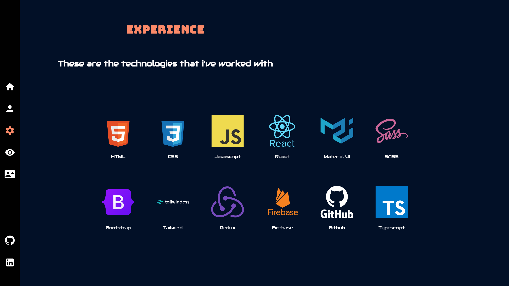

# Project Title

Portfolio

## Demo link:

<!-- Access my site at [google.com](https://google.com) -->

## About The App

[Portfolio] is an mobile responsive app that displays the projects i have worked on and the tools I have used to build these projects. You can contact me with the email page and go to the websites I created on the projects page with other with other pages showing different details about me.

## Screenshots

## Technologies

  &nbsp;
  &nbsp;
  &nbsp;
  &nbsp;
  &nbsp;

## Approach

Built with React and styled with Material UI and multiple other tools for smooth user experience

