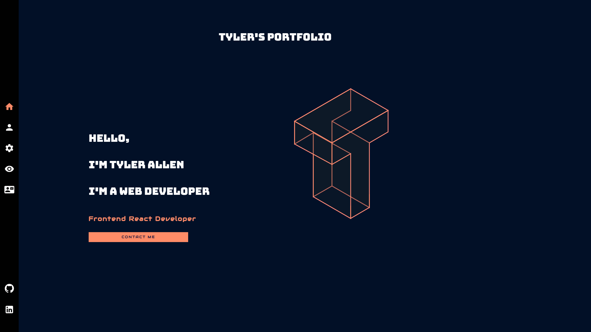

# Project Title

Portfolio

## Demo link:

<!-- Access my site at [google.com](https://google.com) -->

## About The App

[Portfolio] is my mobile responsive portfolio website talking about my self, skills and projects i've created during my time as a web developer.

## Screenshots

## Technologies

  &nbsp;
  &nbsp;
  &nbsp;
  &nbsp;
  &nbsp;
  &nbsp;

  

## Approach

Built with React styled with SASS, Material UI , GSAP, React-Typical and Framermotion. emailJS for email sending. 
