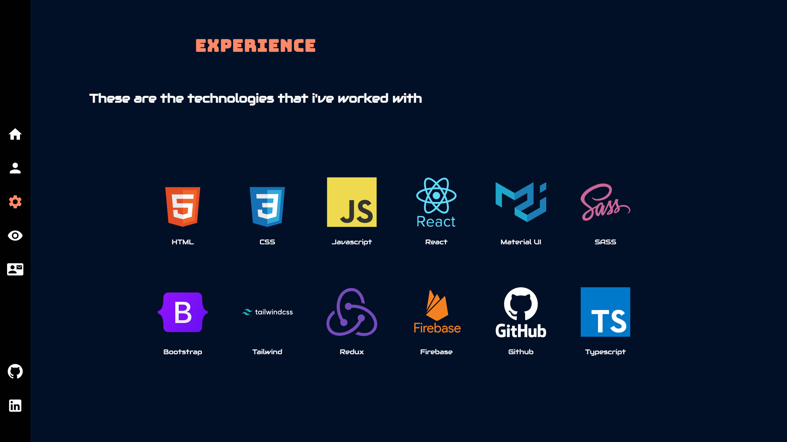

# Project Title

Portfolio

Access my site at https://tyler-allen.com

## About The App

[Portfolio] is an mobile responsive app that displays the projects i have worked on and the tools I have used to build these projects. You can contact me with the email page and go to the websites I created on the projects page with other with other pages showing different details about me.

## Screenshots

## Technologies

&nbsp;
&nbsp;
&nbsp;
&nbsp;
&nbsp;

## Approach

Built with React and styled with Material UI and multiple other tools for smooth user experience

## Netlify environment & deploy (UTM tracking)

If you want outbound UTM clicks recorded when destinations don't run your analytics, set these Netlify environment variables:

- `MP_MEASUREMENT_ID` = your GA4 Measurement ID (e.g. `G-GWQ3VQBNLB`)
- `MP_API_SECRET` = Measurement Protocol API secret (create in GA4 Admin → Data Streams → Measurement Protocol API secrets)

Add them in Netlify: Site → Site settings → Build & deploy → Environment → Environment variables. Mark the API secret as Secret. Save and trigger a deploy.

Verify: click an external link on the live site and confirm a POST to `/.netlify/functions/send-mp` (DevTools Network) and an `outbound_click` event in GA4 Realtime.
